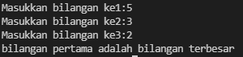

# labspy02
1.masukkan bilangan pertama
2.masukkan bilangan kedua
3.masukkan bilangan ketiga
4.apabila bilangan pertama lebih besar dari pada bilangan kedua dan ketiga maka akan menampilkan teks bilangan pertama adalah bilangan terbesar
5.tetapi apabila bilangan kedua lebih besar dari bilangan pertama dan ketiga maka akan menampilkan teks bilangan kedua adalah bilangan terbesar
6.lalu apabila bilangan ketiga yang memiliki nilai paling besar maka akan menampilkan teks bilangan ketiga adalah bilangan terbesar

